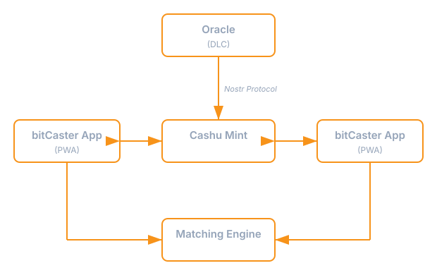

bitCasterは、オープンプロトコルで通信する独立したサービスで構成されています。

各ユーザーはブラウザでアプリの独自インスタンスを実行します。すべてのユーザーは同じ共有インフラストラクチャに接続します。

## Cashuミント

ミントはシステムの中核です。
通常のecashトークンと特定のマーケット結果にロックされた条件付きecashトークンの両方を発行します。
イベントが解決されると、ミントはマッチングエンジン側のフローを通じて供給された検証済みの結果に基づいて決済を行います。勝利トークンはsatsに償還可能になり、敗北トークンは期限切れになります。

## bitCasterアプリ

ユーザー向けのプログレッシブウェブアプリ（PWA）です。完全にブラウザ内で動作し、トークンをローカルに保持します。アプリはすべてのトークン操作（ミンティング、スワップ、償還）についてミントと直接通信し、注文板アクセスについてはマッチングエンジンと通信します。

## マッチングエンジン

マッチングエンジンは各マーケットの中央指値注文板（CLOB）を維持します。買い注文と売り注文をマッチングし、リアルタイムの価格更新をブロードキャストします。また、Nostrオラクルネットワークに接続し、登録済みマーケットに関係するオラクルのアナウンスメントとアテステーションを監視・検証し、アテステーションが到着したときにマーケットのクローズを調整します。

これが唯一の中央集権的なコンポーネントです。注文マッチングは本質的に単一のシーケンサーの恩恵を受けるコーディネーション問題であるため、存在しています。

## オラクルネットワーク

オラクルはアナウンスメントとアテステーションをNostrリレーへ公開できます。これらのリレーは信頼されない公開ネットワークとして機能します。イベントを配送・キャッシュ・遮断することはできますが、無効なアナウンスメントやアテステーションを有効にすることはできません。bitCasterはNostrを発見と監査のための経路として扱い、信頼の根拠にはしません。署名済みDLCオラクルデータはミントやマッチングエンジンへ直接送信することもでき、使用前に検証されます。

## オラクル

オラクルは、現実世界のイベントを告知し、後にその結果を証明する[Discreet Log Contracts（DLC）](https://www.dci.mit.edu/projects/discreet-log-contracts)のエンティティです。オラクルはアナウンスメントとアテステーションをNostrイベントとして公開でき、それにより発見しやすく監査しやすくなります。bitCasterアプリはNostrネットワークから直接オラクルのアナウンスメントを読み取ることができます。特別なサーバーは不要です。

重要なことに、オラクルはbitCasterから完全に独立しています。アプリやecashについて知る必要はありません。DLCプロトコルを使用して現実世界の事実を証明するだけです。

## オープンソース

上記の登場人物のうち、マッチングエンジン以外の部分はすべてOSSです。ソースコードは[こちら](https://github.com/joemphilips/bitCaster)。
資産や個人情報管理に関与する部分すべてがOSSなので、ぜひ自己責任で検証および改善を行ってください。

唯一マッチングエンジンだけはクローズドソースです。これは、スパム対策などの理由から詳細な仕様を非公開にすることが望ましい場合があるためです。
[APIの仕様](https://github.com/joemphilips/bitCaster/tree/main/BitCaster.MatchingEngine.Contracts/specs)はオープンなので、ご自身でマッチングエンジンを作ることもできます。
